# LLM
Large Language Models (LLMs) - A type of foundation model that is designed to understand and generate human language. LLMs are trained on massive datasets of text and code, and they can be used for many tasks, such as writing, translating, and coding.

##  how LLM tokens work?

### Tokenizer

Tokens are the CURRENCY of LLMs. LLM cost is charged by Tokens.
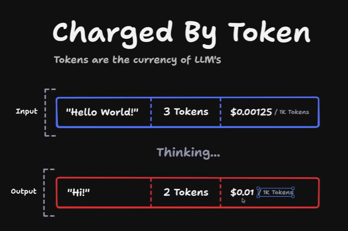

Every model have different inputtokens and output tokens for same words and price per 1k tokens is also different.
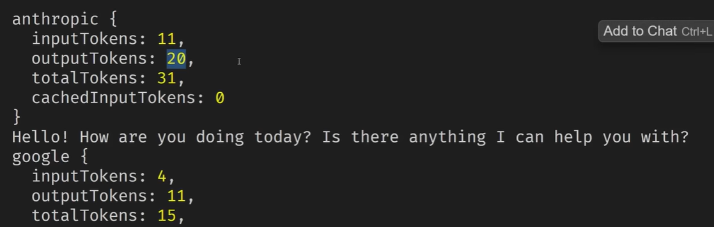

Now, come to concept of Encoding and Decoding

### Encoding
Turning "Text" into "Tokens".

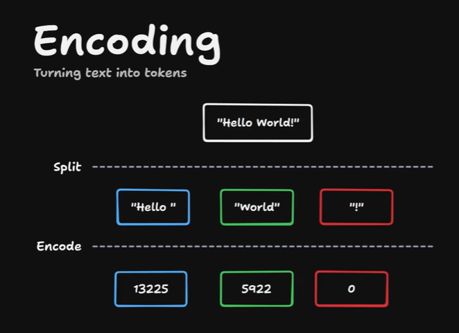

End-to-End Process - LLM are Large Language Model but they do not understand Language. LLM is not dealing with "words", it deals with Tokens (Numbers) / Vectors.

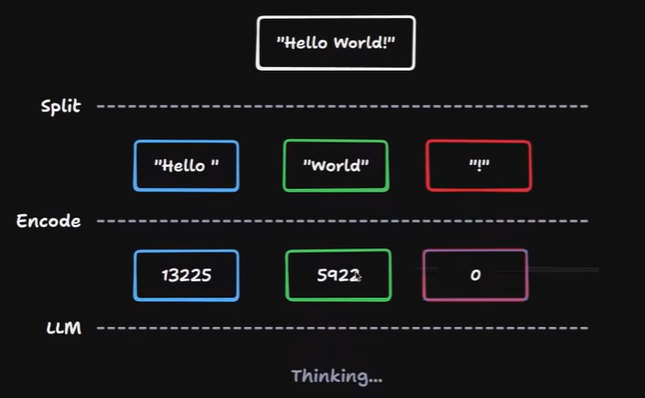

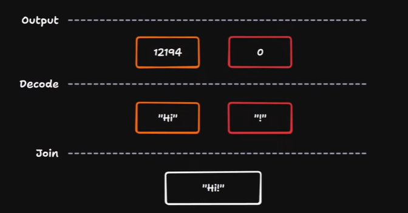

### Decoding
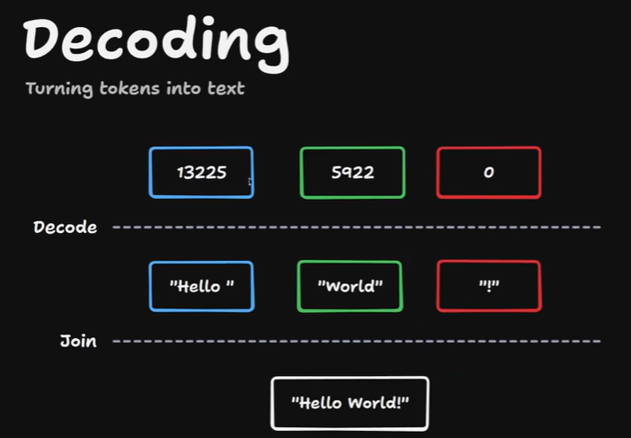

### Tokenizer training
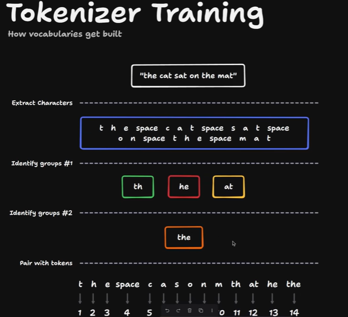

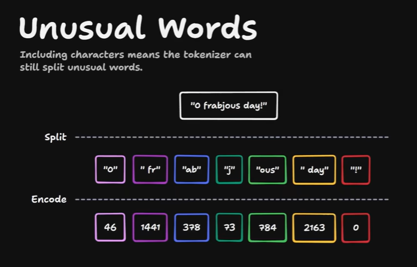

## Word Embedding / Vector Embedding / Embeddings
AI Turns "Words" into "Vectors". Vectors are numbers.

It turns word into special number call vector. 
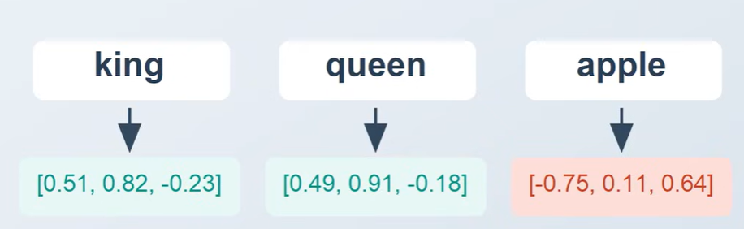

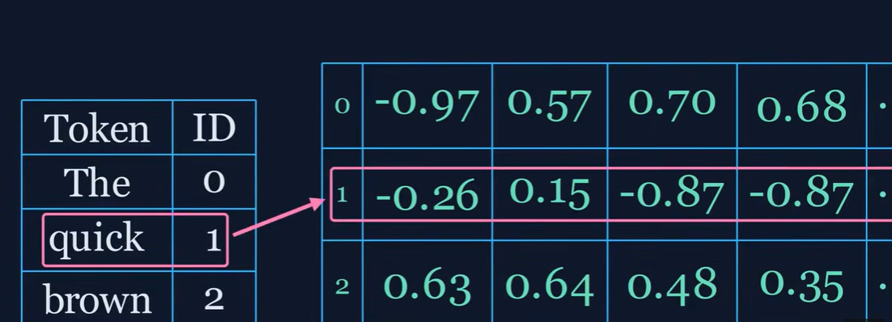

### LLM Embeddings

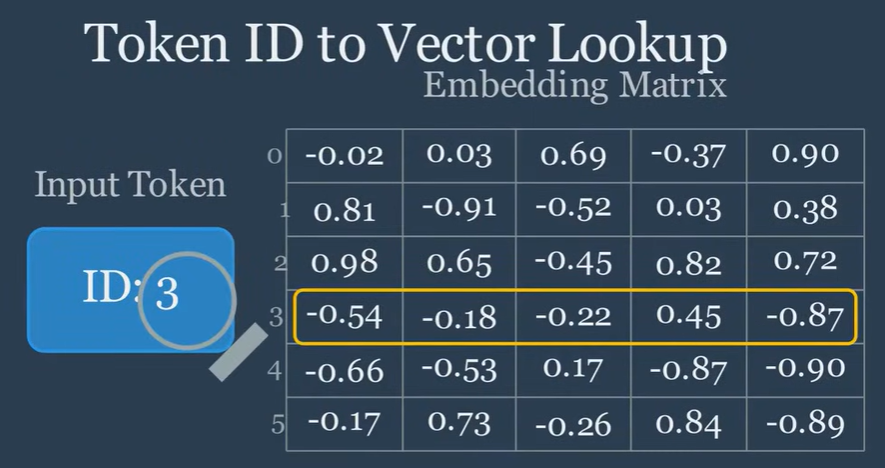

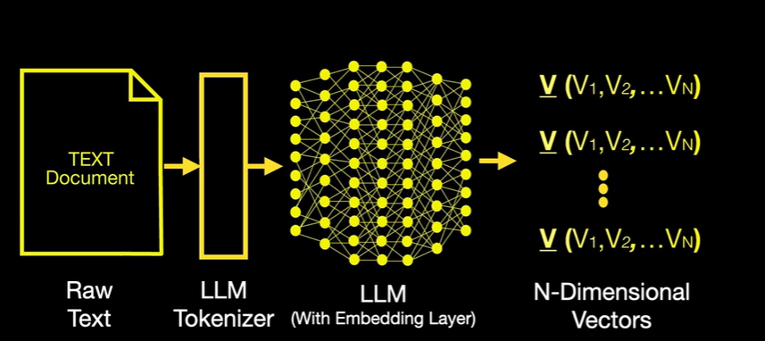

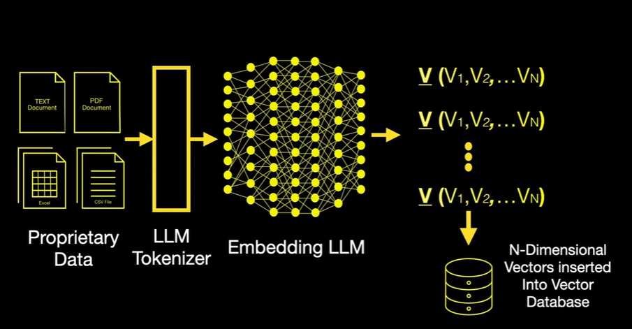

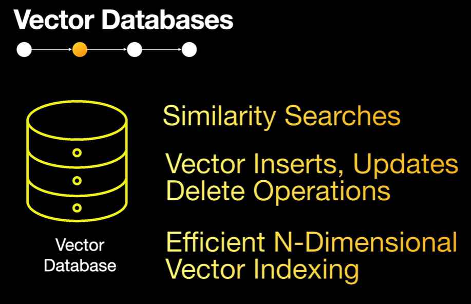

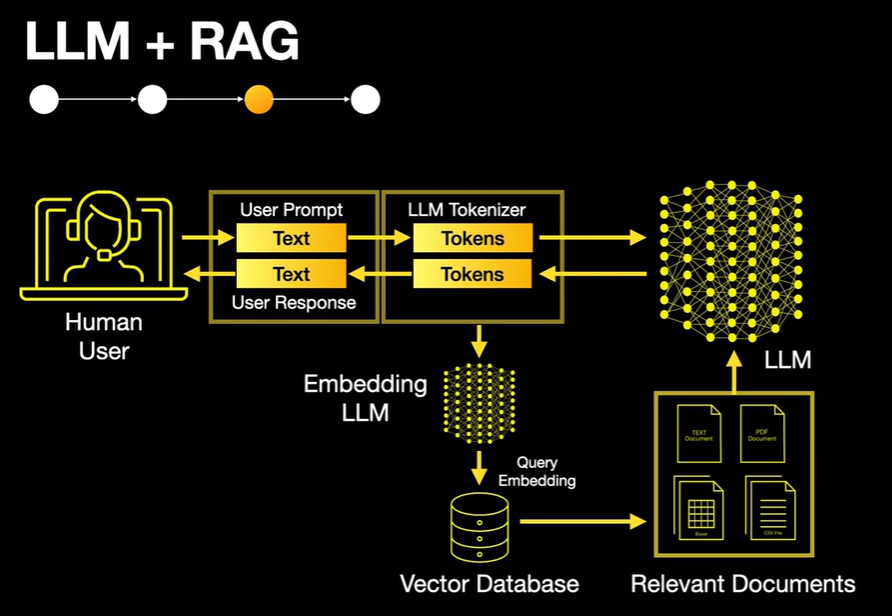

# GPTs - Generative Pre-trained Transformer 
A type of AI model designed to understand and create human-like text, code and images.

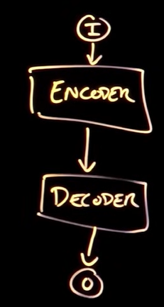

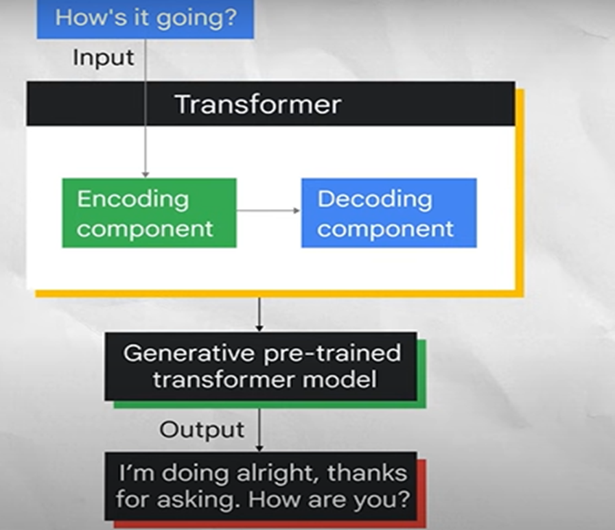

## LLM Concepts

Weights, Context and Memory

#### Weights - Core parameters in LLM models learned during training and fine-tuning. These are basically languages, coding, maths, reasoing, everything LLM model learns. 

#### Context - Context containes input prompt + model response. Context is dynamic and changed with each interection.

#### Memory - Memory allows LLMs to retain infomation for long term beyong single interection and use across multiple interections. It persists across sessions.

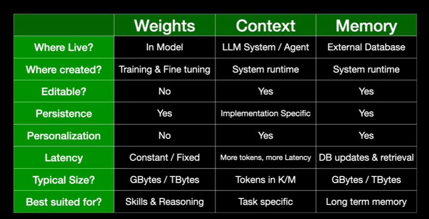

#### Context Windows

Input + output tokens make context window.
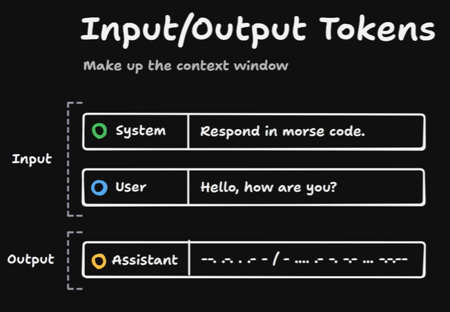

Each model provider have setup limit for context window.

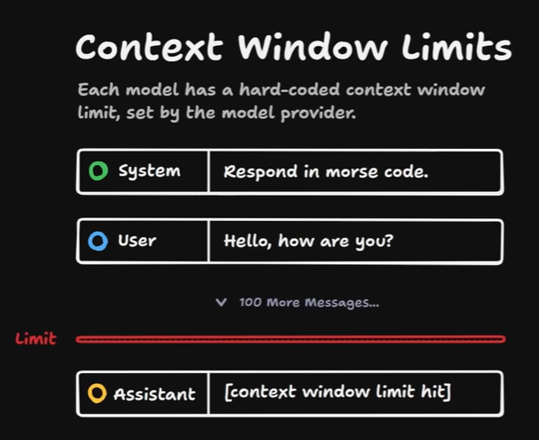

Why there is limit?
1. LLM processing is expensive, more tokens means more processing
2. Larger the context window, more performance degrade.

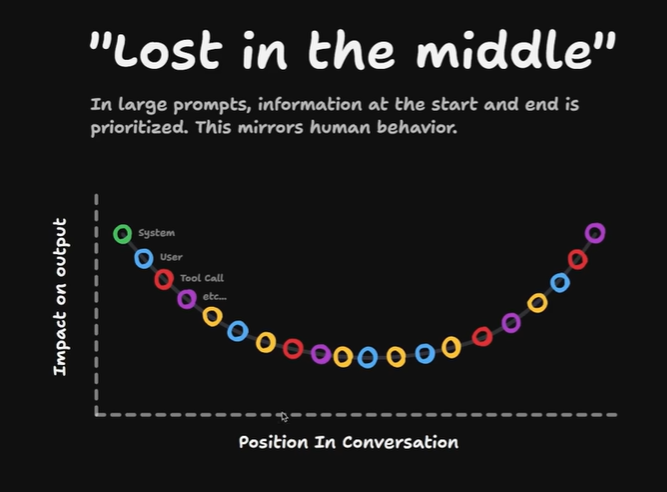

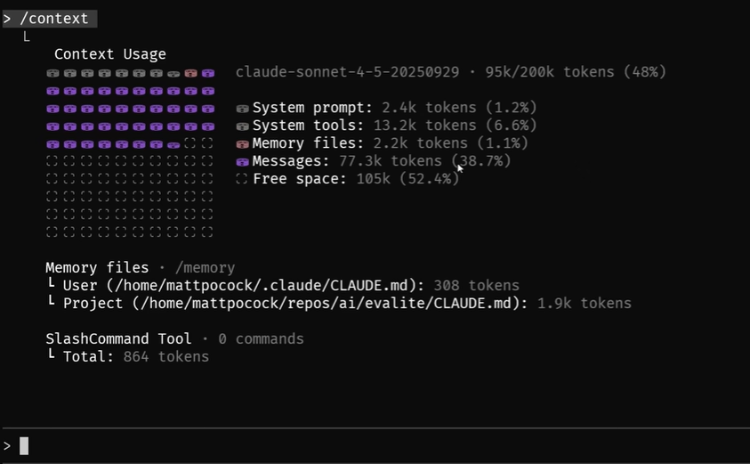

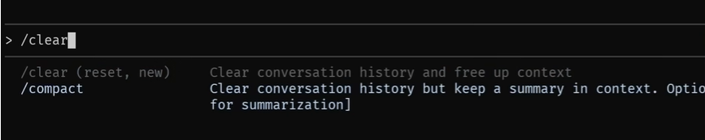

