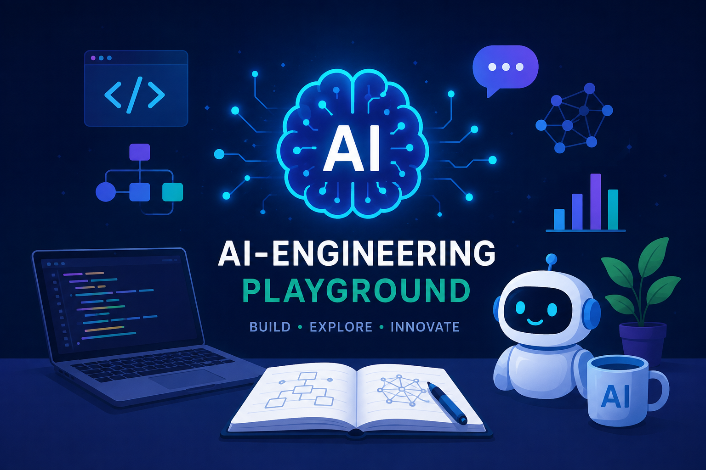

# 🧪 ai-engineering-playgroud

[](https://github.com/Vish-TechOps/ai-engineering-playgroud/commits/main)
[](https://github.com/Vish-TechOps/ai-engineering-playgroud/stargazers)


AI-native workspace for AI experiments.

AI adoption — An AI-native / AI-powered transformation of business workflows from prototyping to shipping intelligent systems to production at the speed of AI. Let's collaborate and build this together!



---

## 📂 Repository Structure

| Folder / File | Purpose |
|---|---|
| `LLM/` | LLM experimentation — prompting, model behavior, evaluation |
| `MCP/` | Model Context Protocol servers and client integrations |
| `Neo4j/` | Graph database setup and traversal experiments |
| `Prompts/` | Prompt library and prompt-engineering iterations |
| `Python/` | Supporting Python scripts and utilities |
| `Qdrant/` | Vector database setup and similarity-search experiments |
| `RAG/` | Retrieval-Augmented Generation pipeline experiments |
| `rag-neo4j/` | RAG implementation backed by Neo4j graph retrieval |
| `rag-qdrant/` | RAG implementation backed by Qdrant vector retrieval |
| `.env.example` | Environment variable template |

## 🔍 Focus Areas

- **Retrieval-Augmented Generation (RAG)** — comparing graph-based (Neo4j) and vector-based (Qdrant) retrieval strategies
- **Model Context Protocol (MCP)** — connecting LLMs to tools, data, and services through a standard interface
- **LLM experimentation** — prompt design, evaluation, and model behavior analysis
- **AI-native workflows** — prototyping patterns that are built to be shipped, not just demoed

## 🚀 Getting Started

```bash
git clone https://github.com/Vish-TechOps/ai-engineering-playgroud.git
cd ai-engineering-playgroud
cp .env.example .env   # add your API keys and connection details
```

Each folder is self-contained — check for a local README or entry-point script before running an experiment. Qdrant and Neo4j experiments assume you have a local or hosted instance of the respective database running and referenced in `.env`.

## 🤝 Let's Build Together

This is an open, evolving playground for AI-native engineering. If you're exploring similar problems in RAG, MCP, or agentic workflows, open an issue, fork it, or reach out — let's collaborate and build this together!

## 👤 Author

**Vishvendra Singh** — AI Engineer • Technology Leader • Innovation • Strategy • Governance • Observability • DevOps • SRE • Cloud • Open-Source Contributor

[LinkedIn](https://www.linkedin.com/in/vishvendrasingh1) · [GitHub](https://github.com/Vish-TechOps)
